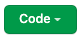

# Stopwatch

## Project Description

This is a simple stopwatch project. I did this to get a better understanding of the `Date()` and `.getTime()` functions within JavaScript. I ended finding an example that used the `clearInterval` and `setInterval` methods which was a nice surprise so I ended up trying that instead. I added styling through css.

## Technologies Used

- HTML
- CSS
- JavaScript (get/set Interval)

## Images

> Screenshot of stopwatch page

## Installation Instructions

To install this repository:

- If you would like to fork the repository so you have your own copy, feel free to!
- Click on the green "Code" button. 
- Copy either the HTTPS or SSH link that is provided
- Open up the Terminal and navigate to the desired directory location
- Once inside, use the code "`git clone` copied_link_here"
- Once the repo has been installed, change into the directory with `cd stopwatch-project`
- From here you can run `code .` to open it up in VS Code
